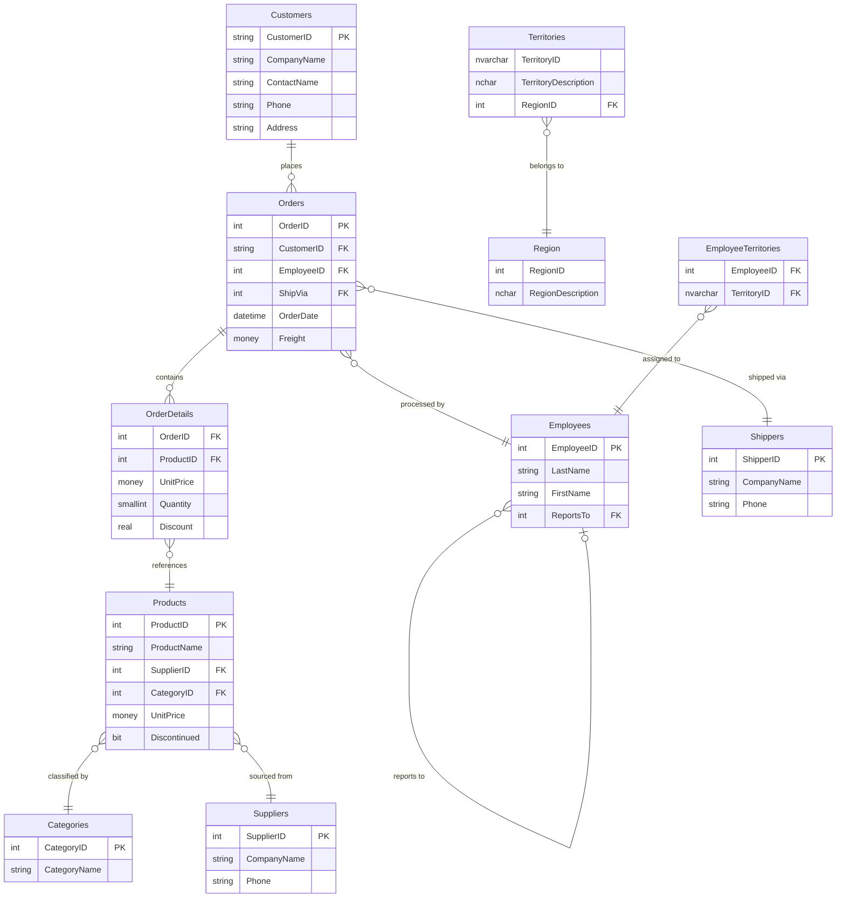
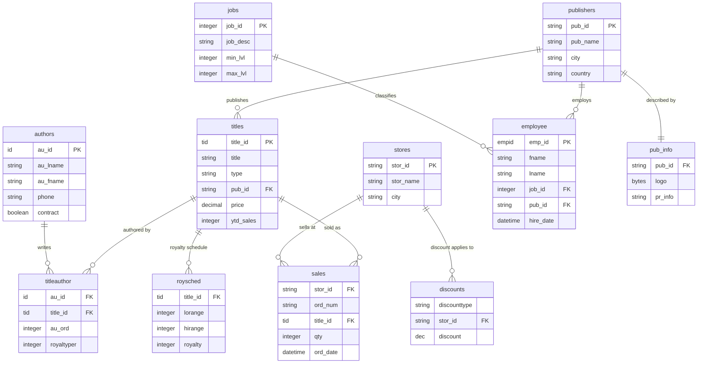

# Entity Relationships

_Generated: 2026-05-29T09:32:44.268490+00:00 by M3 Data Architecture Agent (Claude Code)_

### All Relationships — Master Table

| # | Source | Target | Cardinality | FK Field | Constraint Name | Confidence | Type | Evidence |
|---|---|---|---|---|---|---|---|---|
| 1 | Order Details | Orders | Many→One | OrderID | FK_Order_Details_Orders | HIGH | FK_CONSTRAINT | SQL_RELATIONSHIPS |
| 2 | Order Details | Products | Many→One | ProductID | FK_Order_Details_Products | HIGH | FK_CONSTRAINT | SQL_RELATIONSHIPS |
| 3 | Orders | Customers | Many→One | CustomerID | FK_Orders_Customers | HIGH | FK_CONSTRAINT | SQL_RELATIONSHIPS |
| 4 | Orders | Employees | Many→One | EmployeeID | FK_Orders_Employees | HIGH | FK_CONSTRAINT | SQL_RELATIONSHIPS |
| 5 | Orders | Shippers | Many→One | ShipVia | FK_Orders_Shippers | HIGH | FK_CONSTRAINT | SQL_RELATIONSHIPS |
| 6 | Products | Suppliers | Many→One | SupplierID | FK_Products_Suppliers | HIGH | FK_CONSTRAINT | SQL_RELATIONSHIPS |
| 7 | Products | Categories | Many→One | CategoryID | FK_Products_Categories | HIGH | FK_CONSTRAINT | SQL_RELATIONSHIPS |
| 8 | Employees | Employees | Self-ref | ReportsTo | FK_Employees_Employees | HIGH | FK_CONSTRAINT | SQL_RELATIONSHIPS |
| 9 | Categories | Products | Many→One | (inferred) | — | MEDIUM | INFERRED_JOIN | SQL_RELATIONSHIPS |
| 10 | Categories | Order Details Extended | Many→One | (inferred) | — | MEDIUM | INFERRED_JOIN | SQL_RELATIONSHIPS |
| 11 | Customers | Suppliers | Many→One | (inferred) | — | MEDIUM | INFERRED_JOIN | SQL_RELATIONSHIPS |
| 12 | Customers | Orders | Many→One | (inferred) | — | MEDIUM | INFERRED_JOIN | SQL_RELATIONSHIPS |
| 13 | Customers | Order Subtotals | Many→One | (inferred) | — | MEDIUM | INFERRED_JOIN | VIEW_JOIN |
| 14 | Order Details | Shippers | Many→One | (inferred) | — | MEDIUM | INFERRED_JOIN | SQL_RELATIONSHIPS |
| 15 | Order Subtotals | Orders | Many→One | (inferred) | — | MEDIUM | INFERRED_JOIN | VIEW_JOIN |
| 16 | CustomerCustomerDemo | Customers | Many→One | CustomerID | — | LOW | INFERRED_JOIN | SQL_RELATIONSHIPS |
| 17 | EmployeeTerritories | employee (pubs) | Many→One | EmployeeID | — | LOW | INFERRED_JOIN | SQL_RELATIONSHIPS |
| 18 | EmployeeTerritories | Employees (Northwind) | Many→One | EmployeeID | — | LOW | INFERRED_JOIN | SQL_RELATIONSHIPS |
| 19 | Orders | employee (pubs) | Many→One | EmployeeID | — | LOW | INFERRED_JOIN | SQL_RELATIONSHIPS |
| 20 | Territories | Region | Many→One | RegionID | — | LOW | INFERRED_JOIN | SQL_RELATIONSHIPS |

**CONFIRMED (source+constraint evidence):** Relationships 1–8
**INFERRED (view/join analysis):** Relationships 9–15
**LOW — ambiguous or cross-database:** Relationships 16–20

---

### ERD — Northwind Core (Mermaid)

---

### ERD — pubs Core (Mermaid)

---

### Cross-Database Ambiguity Flags

**AMBIGUITY 1 — EmployeeTerritories EmployeeID target:**
- Maps LOW confidence to `Employees.EmployeeID` (Northwind) AND `employee.emp_id` (pubs)
- These are different entities in different databases
- Resolution: Northwind.Employees is the correct target based on domain context
- Confidence: LOW — no FK constraint confirmed

**AMBIGUITY 2 — Orders.EmployeeID secondary inferred mapping to pubs.employee:**
- Relationship 19 is almost certainly a false inference
- Orders belongs to Northwind; employee belongs to pubs
- Recommendation: Discard this relationship as cross-database noise

---
